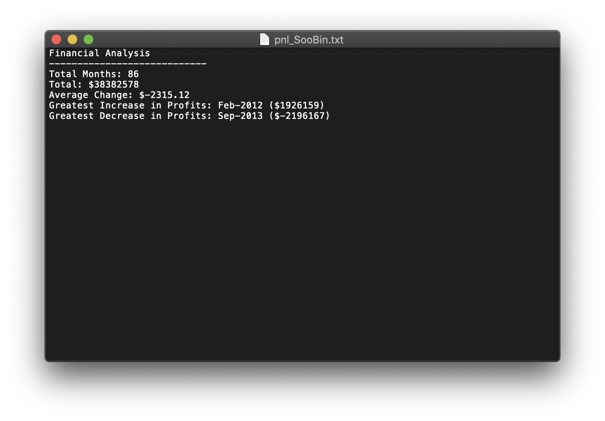
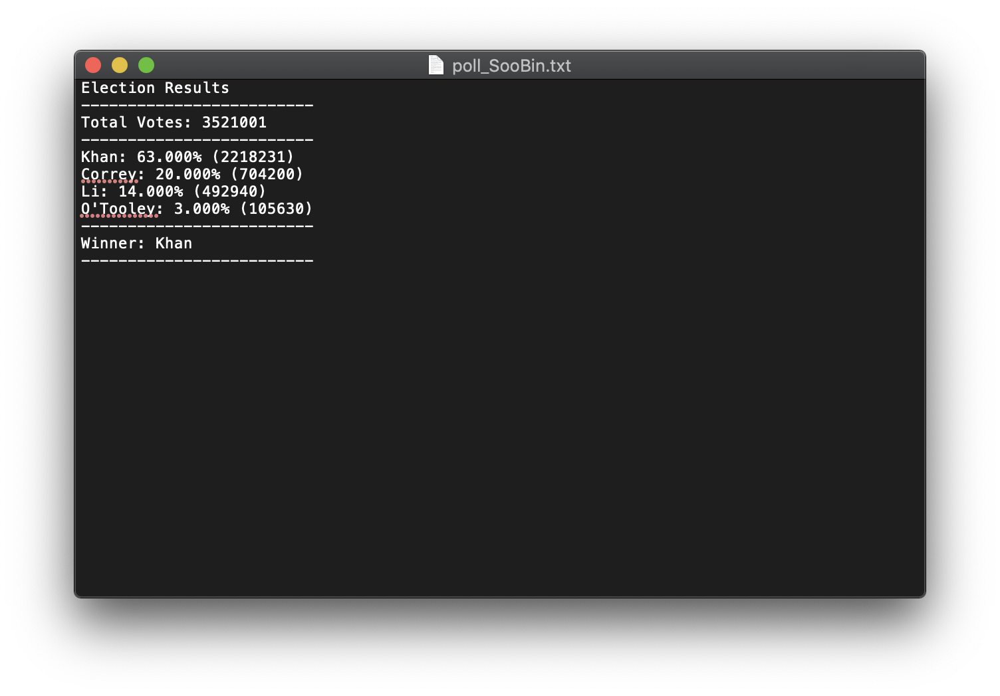

# Python Analyses
These analyses consist of two datasets:
1. Profit and loss data of a fictional bank, and
2. Results of a fictional election.

The first dataset (`PyBank/budget_data.csv`) contains monthly profit and loss data of a bank from January 2010 to February 2017. The following information is obtained using python:
* The total number of months included in the dataset,
* The net total amount of P&L over the entire period,
* The average of the changes in P&L over the entire period,
* The greatest increase in profits (date and amount) over the entire period, and
* The greatest decrease in losses (date and amount) over the entire period.

The second dataset (`PyPoll/election_data.csv`) entails includes election results of a fictional town. Using python, the following information is calculated:
* The total number of votes cast,
* A complete list of candidates who received votes,
* The percentage of votes each candidate won,
* The total number of votes each candidate won, and
* The winner of the election based on popular vote.

For codes, refer to these scripts:
* `PyBank/pnl_SooBin.py`
* `PyPoll/poll_SooBin.py`